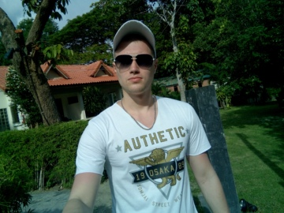

## О себе

31 год, женат, двое детей.

Имею высшее теплотехническое образование. 

Работаю инженером теплотехником на производстве уже почти 11 лет.
Пришло понимание, что пора сменить сферу деятельности. Выбрал профессию "инженер по тестированию", пока в обучении все получается. У меня обязательно все получится! Всем добра!

